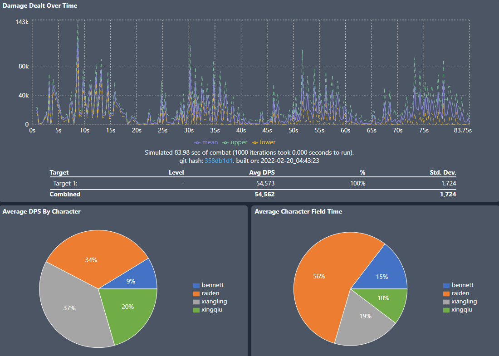

# Introduction

Hello! This is an extensive practical guide for anyone who is interested in using gcsim, which is a combat simulator tool for Genshin Impact. In short, gcsim simulates combat using an action list for a given team and returns the overall team DPS, along with a slew of additional useful information regarding team performance and characteristics such as character-level DPS breakdowns by skill, energy generation, reaction counts, and more. Here for example, is what the top level breakdown looks like:



Note that the sim is currently under active development and we are constantly refining our knowledge of game mechanics and making changes. Currently we believe that the sim is in a usable state for many teams as we are very close to many of the most recent spreadsheet calculations for common teams (with some current major exceptions discussed in Sim Outstanding Gaps). With that being said, as with any calculations work, you should always make sure that the results you get out of the sim seem reasonable, and please let us know either on the Github or in our Discord server if you have any suggestions or bug reports. 

The rest of this guide dives into actually working with the sim for various use cases. The guide is pretty long/extensive for people with different use cases, but below are a few suggestions if you’re just starting out, though we recommend reading the rest of this page before jumping to other sections:
- If you want to get started quickly and are new to sims and theorycrafting, then you likely want to finish reading this page, and then hop over to the [Sequential Mode Guide](sequential_mode.md)
- For more advanced TC work and alignment to sheet calcs, please check out [Advanced: KQM Standards and Alignment to Sheet Calcs](kqm_standards_sheet_calcs.md)
- Finally for those who are interested in action priority lists, which allow for simming desync or quickswap style teams that do not have a completely fixed rotation, then please see the [Action Priority Mode Guide](action_priority_mode_guide.md)

# Sim Description and Getting Started
The sim works by stepping through each frame of combat, and performing actions (e.g., normal attack, charged attack, skill, burst, etc.) according to a user specified action list. The action list is at the core of gcsim, and defines the order that characters will use their listed abilities if possible based on the character’s current skill cooldowns, energy, or other custom user-specified conditions. Combat details such as buffs, debuffs, and elemental applications/gauges/auras are automatically tracked frame-by-frame.

gcsim is Monte Carlo simulation, meaning that we run hundreds (or more) of combat simulations, and we report results based on those averages. The primary benefit to this approach is that random events such as particle generation, critical hits, and weapon procs are simulated exactly, so for example in one run, sacrificial sword may proc, whereas in another run sacrificial sword may not, which causes rotation and overall team DPS changes. This can lead to higher accuracy than simply assuming averages where everything always works, and also allows us to quantify the DPS variance caused by these random events.

Ultimately, gcsim is a tool that can be given certain input assumptions, and then simulate the aspects of gameplay that are easily quantifiable. However, it is not meant to simulate all aspects of combat in Genshin and provide a generalized team “tier list”, nor is it meant to determine whether a team is always strictly better than another, as in-game team DPS can vary greatly due to many unquantifiable factors like number of enemies, enemy type, enemy movement, dodging requirements, knockback, or difficulty of execution. 

To get started on the basics of how to use the site, please see the [Getting Started](../get-started.md) page.

# Action List Basics
Creating action lists for new teams can have a learning curve, but the syntax is not too complicated to learn for single rotations to get your feet wet before diving into more complicated rotations. 

The most important basic of action lists, is that the semicolon `;` is used to end each distinct command. This means that you can (and are encouraged), to use whatever spacing you like to ensure that your action list is readable. So for example, the below two commands are completely equivalent:
```
raiden skill,dash,burst,attack,charge,attack,charge;
```
```
raiden skill,dash,
       burst,
       attack,charge,
       attack,charge;
```
Another important note is that the hash/pound sign `#` is used to denote comments, which let you annotate your list without it affecting the actual operation. So something like the below:
```
# Use N1C at the end since it can be really hard to get the N2C off.
raiden attack:4,charge,dash
       attack:4,charge,dash
       attack,charge;
```

There are two major modes of operation for the sim, which determines the overall syntax and style of any new action lists, Sequential Mode and Action Priority Mode, and you need to decide what style of action list you want to write.

For new users, we strongly recommend Sequential Mode, so please see the [Sequential Mode Guide](sequential_mode.md) once you've finished reading the remainder of this section, which covers the basics for all types of action lists.

## Sim Options
The first important setting are the sim `options`, which look something like this:
```
options iteration=500 duration=100 mode=sl;
```

There are only a few key settings to note here:
- `iteration` - This controls the number of times that you want to run the simulation. In general, we recommend at least 500 iterations for most teams. If your team has a high RNG factor (e.g., Eula Q, low crit, barely meets ER requirements), then you may want to increase this number a bit higher.
- `duration` - This controls the combat duration of the sim. In general, you will want to set this to either some multiple of the rotation time for your team (if you know it - for example Hu Tao teams usually use a 21s rotation time due to XQ E cooldown), or some arbitrarily long value (90s is usually a good value since it's half of the 3 min timer for 3 stars in Spiral Abyss)
- `mode` - This should be `sl` for Sequential Mode lists or `apl` for Action Priority Mode lists.

## Enemies
Enemies are easy enough to load, as they look like this:
```
target lvl=100 resist=.1;
target lvl=100 pyro=0.1 dendro=0.1 hydro=0.1 electro=0.1 geo=0.1 anemo=0.1 physical=.3 cryo=.1;
```

The above would load two enemies at level 100. The first one would have 10% resistances to all elements (the standard for most calcs), whereas the second would have 10% to all elements except for a 30% resistance to physical (e.g., what a Mitachurl has).

## Energy Drops
Often times in TC work, we assume a certain number of enemy HP particle drops to calculate ER requirements. The below code lets you control this setting:
```
energy every interval=480,720 amount=1;
```

This code drops one clear particle, randomly every 480-720 frames (or 8-12s), which is somewhat similar to the KQM standard calculation assumption of 3 HP orbs over 90s (e.g., what you'd expect to get from Maguu Kenki over 90s). You can tune the amount of particles or the drop rate as you see fit.

## Character Actions
For more details on this you should see the [Sequential Mode Guide](sequential_mode.md) or [Action Priority Mode Guide](action_priority_mode_guide.md), but here are a few tips common to both types.

At the start of the character action sequence, you should always first specify the starting character with something like:
```
active xingqiu;
```

When you need to repeat a certain action (usually attack), you can use the below syntax to do so, which would cause Raiden to perform an N4C:
```
raiden attack:4,charge;
```

When you perform an action, the sim will use the minimum amount of frames needed to perform the action in game before control is returned to the player. Therefore if you are playing a character that utilizes cancels, you will need to specify them manually, such as:
```
noelle attack:3,dash,
       attack:3,dash;
```
If you want to simulate some kind of uncancelled Noelle combo, then you will need to pad out the frames appropriately. The most common way to do this is to simply add a `jump` after the action instead of a dash.

# Sequential Mode vs. Action Priority Mode
As we've mentioned before, most users should start with sequential mode and can skip this section to go to the [Sequential Mode Guide](sequential_mode.md). This section discusses some pros/cons of each for those curious though.

Here is a quick table to showcase the difference:

| Sequential Mode                                                                  | Action Priority Mode                                                                                                 |
|----------------------------------------------------------------------------------|----------------------------------------------------------------------------------------------------------------------|
| Runs actions in sequence from top to bottom                                      | Runs the highest priority action based on what's available                                                           |
| Cannot easily account for RNG easily (e.g., fav procs)                           | Can automatically change your rotation based on RNG (e.g., remove a feed to XL if you high roll Bennett E particles) |
| Works best with fixed rotations (e.g., Most Hu Tao teams, Raiden National, etc.) | Works best with quickswap or desync rotation teams (e.g., quickswap Keqing, Raiden-Beidou, etc.)                     |
| Does not work with Sacrificial weapons (currently)                               | Works with Sacrificial weapons                                                                                       |
| Direct and easy syntax                                                           | Complicated, but more flexible syntax with arbitrary conditionals available                                          |

## Sequential Mode
Sequential mode is very straightforward as it runs through a provided sequence of actions in order from top to bottom. This mode is recommended for beginners or for fixed rotations, but generally results in inflexible action lists (e.g., difficult to account for random events such as Sacrificial weapons not proccing).

## Action Priority Mode
Action Priority Mode is more complicated - these Action lists work as a priority queue, so what happens is that whenever it is possible to run a new action, the sim will scan through the action list that you provided from top to bottom, and will pick the first possible one to run. The benefit of this approach is that you are not beholden to a purely fixed rotation, which allows you to run a single action list across a wide variety of situations. For example, a single action list can easily account for situations where Sacrificial Sword procs vs. situations where it does not proc with a few conditionals. Furthermore, Priority Mode action lists allow for on the fly adjustments related to other sources of RNG such as elemental particle production, which can alter rotations.
