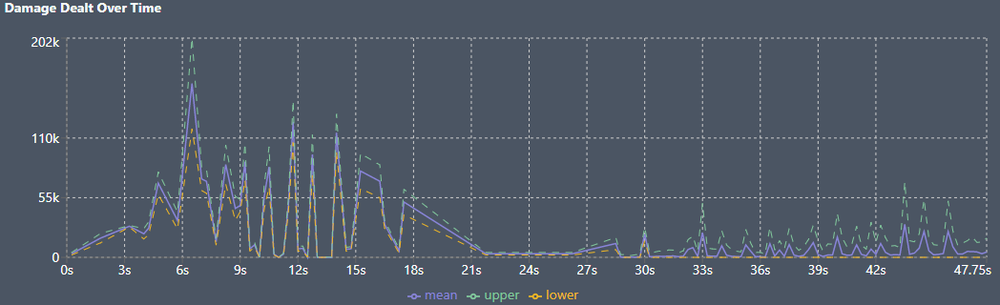

# Basics
Sequential mode lists step through the provided action list, executing each action in order. To use these, you will need to add `mode=sl` to the `options` command in your config.

These are the most direct way to specify fixed rotation comps, or comps with little RNG.

# Creating a New Calc Mode Action List
Creating one of these is very easy, as you basically just want to write out the sequence of actions that you see in your reference into the sim, which should hopefully be straightforward and the syntax should not be too complicated. Below is an example of a rotation that is loosely based on [this Childe-Bennett-Xiangling-Sucrose rotation guide video](https://www.youtube.com/watch?v=lNigAHNAgOU).

```
active bennett;

bennett skill,dash,burst;

sucrose dash,skill;

xiangling burst,skill;

tartaglia burst,skill;

tartaglia attack:3,charge,dash,
          attack:3,charge,dash,
          attack:3,charge,dash,
          attack:3,charge,dash;
          
bennett skill;

xiangling jump:5;

bennett skill;

xiangling jump:5;

restart;
```

Note that I have made a few slight modifications here to the rotation in the video, namely:
- Because the sim executes orders in sequence from top to bottom and doesn’t automatically loop, if you need to simulate for longer than a single rotation, then you should use the “restart” keyword, which basically “restarts” only the action order part of the configuration.
  - For example in the above, once the “restart” keyword is reached it will start over at the top using Bennett's skill - dash - burst sequence.
- The video doesn't do Childe's combos very cleanly, so I changed it to the standard 4N3C
- The video has Xiangling walking around for a bit to catch particles after Bennett E. Here, I simply gap filled that by making Xiangling jump 5 times to fill the time. Without doing that, then the sim would swap back to Bennett on the first available frame, and Xiangling wouldn't catch the particles.

# General Tips
- Be very careful about weapons with RNG based procs in calc mode, especially Sacrificial weapons, as there is no way to change your rotation depending on if it procs or not. You should use a Priority Mode list instead for those teams.
- If you’re simming for more than one rotation, then it may be useful to either overstack ER or add more HP particles to ensure that you rotate properly as this mode cannot dynamically account for particle RNG. For example, if you don't have enough energy on Xiangling by the time you come back around to her in rotation 2 in the sim, then the sim will simply stop and wait on Xiangling until she does get enough energy.
- More generally, you should always be checking the results summaries, details, and debug on a first run to make sure that your rotation works. The most obvious place to see this is in the Damage Dealt Over Time chart. For example, if you see the below happening, then it likely means that you don't have enough ER since there's basically no damage happening on rotation 2.


