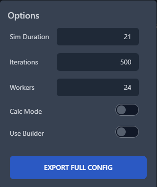
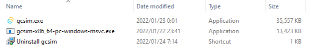

## Introduction

Substat optimizer mode is a currently **experimental** feature that attempts to optimize your artifact substats given an action list and a few key inputs. This can be useful if:
1. You are doing theorycrafting work and want to align your calculations to a given set of standards
2. You do not have your artifacts available from another source such as Genshin Optimizer and would like to generate some results with reasonable artifact presets

Currently in practice, we have found the substat optimizer module to be roughly on par or slightly exceeding hand optimizing, and it generates results that yield team DPS within 1-5% of using a sheet to optimize substats instead. If you encounter any teams that yield unexpected results, please feel free to reach out to us on our Discord.

Note that by default the substat optimizer will assign substats that adhere to the KQM Standard. If you would like to use different assumptions, please see Additional Options.

## Usage

Due to a broader UI rework, the substat optimizer module is not currently built into the UI, and must be operated from the command line. Below we provide a brief guide on basic usage.

Before using the optimizer, you will first need to setup your team in the UI. You will need to set up all elements for a team, so you will need:
1. A team of characters, which each have listed:
   - Level, Constellation, Talent
   - Weapon with level and refine
   - Artifact sets with main stats
   - A valid action list
2. If you have an existing configuration with substats already inserted, you do not have to remove them. The substat optimizer will automatically ignore those substat lines.
3. If you are used to sheet calcs, note that this substat optimizer also optimizes ER substats, so there is technically no need to use an ER calculator. With that being said, note that this substat optimizer may produce very unexpected results for some configurations (calc mode configs especially), if you are completely unable to meet ER requirements for a given rotation.
   - An example that we have seen in practice is that the optimizer may sometimes return that 0 ER substats is the "most optimal" if you can't burst off of cooldown.
4. As with most other things when using the sim, do not blindly trust the results and make sure to look at the summary stats and debug to make sure that the team is performing as you would expect.

Once you have this all set up, then you will want to go to the "Sim" tab, and under "Sim Options", click on the "Export Full Config" button at the bottom



Save the file to a location of your choosing, but it will likely be easiest for you if you save it into the same folder as your gcsim installation.

Next you will need to navigate to your gcsim installation location, which is a folder that looks like this:



Next you will want to open up a command line at this location. On Windows you can hold shift and right click in the empty space in the folder, and select the "Open PowerShell window here" option. 

From here, you will want to run the following command:

```
gcsim-x86_64-pc-windows-msvc.exe -c="[[PATH TO SAVED CONFIG HERE]]" -substatOptim=true -out="[[PATH TO DESIRED OUTPUT CONFIG HERE]]" [[ANY OTHER ARGUMENTS HERE]]
```

Below are a few key points about the arguments:
1. The `-out` flag is a convenience measure which outputs a new copy of the configuration file at the specified location without any of the existing substat lines, and has the final optimized substat lines instead.
2. Some configurations will require additional arguments - you can view a full set of flags with `gcsim-x86_64-pc-windows-msvc.exe -help`, but the most common one that you may need to add is `-calc` if you are using a calc mode configuration.

After you run the above command, the routine will need to run for a while before returning an output. On my somewhat beefy machine it takes around 15-30 seconds depending on the configuration, but note that it will likely use a high amount of CPU over that period. If you want it to run a bit more slowly and use fewer CPU cores, then in the "Sim Options" window in the UI, set the number of workers to a lower number and re-export the file. Alternatively you can change the "workers" number in the `options` line at the top of the config directly.

You will see some text being output that is mostly there for information purposes, which you can mostly ignore unless you are interested in the information, but it does report things like the final liquid substat counts for each character if that is easier for you to visualize.

After getting the output configuration, you can run it either by pasting it back into the "Sim" tab in the UI (make sure that you disable "Use Builder" in the "Sim Options"), or you can run it via the command line, with something like this:

```
gcsim-x86_64-pc-windows-msvc.exe" -c="[[PATH TO SIM OPTIMIZED CONFIG]]" -out="[[OUTPUT PATH FOR VIEWER FILE]]" -gz="true" [[ANY OTHER ARGUMENTS]]
```

In case it is helpful, below is a small batch file for Windows users that you can use to somewhat automate the process:

```
set argument="%2"

set filename=%1
set output=%filename:txt=json%

"gcsim-x86_64-pc-windows-msvc.exe" -c="config/%1" -substatOptim=true -out="optimized_config/%1" %argument% || exit /b %errorlevel%

"gcsim-x86_64-pc-windows-msvc.exe" -c="optimized_config/%1" -out="viewer_gz/%output%" -gz="true" %argument%
```
To use this, copy the above text into a file in the folder, named "run_optimizer_full.bat" (or whatever you want), and create the three subfolders named "config", "optimized_config", and "viewer_gz". Then run it with:
`run_optimizer_full.bat "[[NAME OF CONFIG]]" "[[ANY OTHER ARGUMENTS]]"`

Finally you can take the output in the "viewer_gz" folder and upload it to the [online viewer](https://viewer.gcsim.app/).

## Additional Options

By default the optimizer will return KQM Standard optimized substats, but if you are interested in doing something different then you can set some semi-colon additional options in the `-options` flag, which are:
1. `total_liquid_substats` (default = 20): Total liquid substats available to be assigned across all substats
2. `indiv_liquid_cap` (default = 10): Total liquid substats that can be assigned to a single substat
3. `fixed_substats_count` (default = 2): Amount of fixed substats that are assigned to all substats
4. `sim_iter` (default = 350): RECOMMENDED TO NOT TOUCH. Number of iterations used when optimizing. Only change (increase) this if you are working with a team with extremely high standard deviation (>25% of mean)
5. `tol_mean` (default = 0.015): RECOMMENDED TO NOT TOUCH. Tolerance of changes in DPS mean used in ER optimization
6. `tol_sd` (default = 0.33): RECOMMENDED TO NOT TOUCH. Tolerance of changes in DPS SD used in ER optimization
