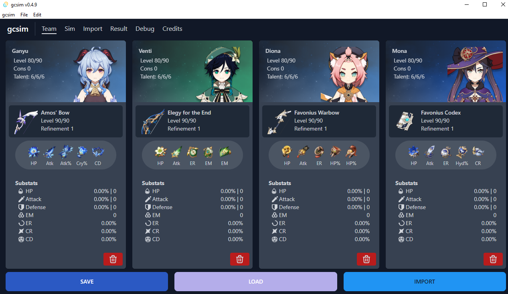
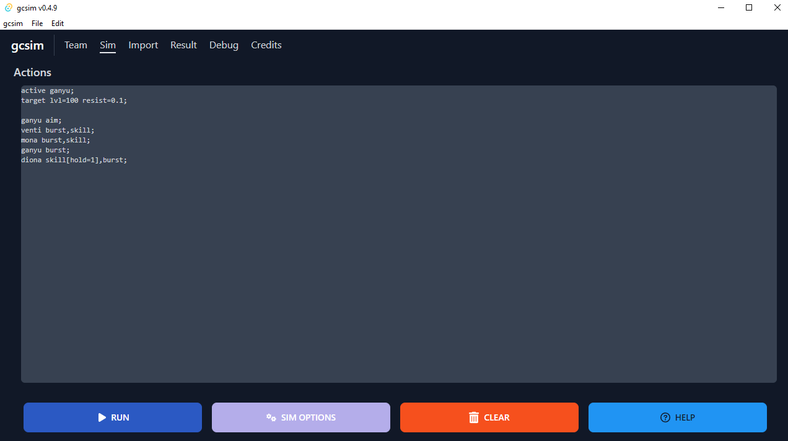

import ReactPlayer from 'react-player'

## Introduction

Calculation mode is a simple way to use the gcsim backend engine to perform calculations. It is **not the normal simulation mode** (and as such is not enabled by default).

However, calc mode can be a simple way to get started with gcsim as it does not require the user to write any priority-based action list. Using calc mode is akin to calculating using a spreadsheet, without the complexity of managing buffs/debuffs as that is taken care by the gcsim backend automatically.

## Video tutorial

Easiest way to get started is by watching this short, albeit unedited, video of a quick example of how to use calc mode

<ReactPlayer controls url='/vid/calc-mode.webm' />

## Get started

Get started by either adding in the characters of the team you wish to calculate for manually or import them from [Genshin Optimizer](https://frzyc.github.io/genshin-optimizer/#/) if you already have them added there. Note that if a character is greyed out, that means that character is not yet supported. We are working hard on adding support for all characters.



Once you have the team you wish to use setup, you will need to enter the commands you wish gcsim in the Sim tab to execute.



### Active character and targets

You will need to set the starting active character as well as the enemy targets. The commands have the following structure:

```
active <character name>;
target lvl=<enemy lvl> resist=<resistane value in decimals>
```

Make sure the `<character name>` is a character actually on the team you have selected. Following our example above, this could be one of `ganyu` `diona` `venti` or `mona` depending on whoever you want to be the initial active character

The `target` command tells gcsim what stats to use for the target you wish to calculate team dps against. `lvl` is the target lvl and should be between 1 to 100. `resist` sets the resistance of the target. For example `resist=0.1` will set every resistance of the target to 10%. If you need to set specific resistances instead (such as higher physical resistance), you can use the following setting:

`target lvl=100 pyro=0.1 dendro=0.1 hydro=0.1 electro=0.1 geo=0.1 anemo=0.1 cryo=.1 physical=.3;`

In this example above, the physical resistance is set to 30%.

If you wish to calculate vs multiple targets, simply duplicate the target line as many times as you wish. For example:

```
active ganyu;
target lvl=100 resist=0.1;
target lvl=100 resist=0.1;
target lvl=100 resist=0.1;
```

This would set 3 targets, each at level 100 with 10% resistance across.

### Character actions

Character actions follows a very simple pattern. They are best understood by example.

**Example 1: Ganyu uses burst followed by skill**
```
ganyu burst,skill;
```

**Example 2: Hutao N2CJ**
```
hutao attack:2,charge,jump;
```